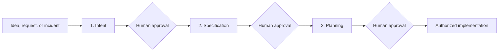

# AI-Native SDLC Playbook

A human-controlled, artifact-driven operating system for taking software work from a rough idea to an implementation-ready plan with AI agents.

This repository contains:

- A complete Markdown playbook for the first three stages of an AI-native software development lifecycle.
- Three executable agent skills: intent discovery, specification readiness, and execution planning.
- Copy-ready `intent.md`, `spec.md`, and `plan.md` templates.
- Human-in-the-loop governance, readiness rubrics, eval guidance, and approval gates.
- Mermaid diagrams for explaining the lifecycle, state transitions, and parallel delivery model.
- A starter workspace for projects, features, improvements, and bug fixes.

## Why this exists

AI makes code generation dramatically faster, but faster coding does not resolve unclear requirements, architecture ambiguity, security decisions, review bottlenecks, or unsafe autonomy. Without a controlled process, agents can produce more code while also producing more rework and risk.

This playbook moves the bottleneck upstream. It creates three durable agreements before implementation begins:

1. What problem and outcome are we committing to?
2. What product and technical system are we committing to?
3. What is the safest, fastest, dependency-aware way to implement it?

The goal is not maximum agent activity. The goal is maximum throughput of approved, verified, safely integrated outcomes.

## The three-stage lifecycle



### 1. Intent — why and what

The intent stage clarifies the problem, users, desired outcome, scope, non-goals, success evidence, constraints, assumptions, dependencies, and open questions. It supports project/product, feature, improvement, and bug modes.

Output: an explicitly approved `intent.md`. It does not select architecture or create a specification.

### 2. Specification — the required product and system contract

The specification stage turns approved intent into testable behavior and deliberate technical decisions. It covers user journeys, requirements, architecture, tenancy and isolation, technology stack, repository strategy, identity and organizations, data, APIs, infrastructure, security, quality, observability, rollout, and acceptance.

For AI systems, it also covers LLM strategy, agent topology, harness/runtime, model router, tools, knowledge, memory, structured outputs, HIL, safety, evals, observability, and cost controls.

Output: an explicitly approved `spec.md`. It does not create tasks, branches, or code.

### 3. Planning — the execution system

The planning stage inspects the real repository and converts the specification into dependency-bounded phases, foundation enablers, epics, features, atomic tasks, evidence gates, parallel groups, engineer-agent lanes, worktree boundaries, integration flow, rollout, and rollback.

Output: an explicitly approved `plan.md` plus only those child work packets that add execution value. It does not implement the plan.

## Human control is a system property

The agent may inspect, interview, challenge, compare, recommend, draft, and evaluate. It may not silently make material decisions or approve its own work.

Every stage ends with three human choices:

- `Approve`
- `Revise`
- `Pause`

Approval is tied to an exact artifact version and upstream baseline. Material changes reopen the affected gate. Planning approval does not automatically authorize merging, deploying, modifying production data, or taking external actions.

## The three skills

| Skill | Starts from | Produces | Hard stop |
|---|---|---|---|
| [`intent-readiness`](skills/intent-readiness/) | Rough request or evidence | `intent.md` + readiness report | Human intent approval |
| [`spec-readiness`](skills/spec-readiness/) | Approved `intent.md` | `spec.md` + decisions + readiness report | Human specification approval |
| [`plan-readiness`](skills/plan-readiness/) | Approved `spec.md` + repository baseline | `plan.md` + necessary work packets | Human planning approval |

Each skill includes:

- `SKILL.md` operating instructions;
- type-specific references;
- canonical templates;
- readiness rubric and structural evaluator;
- eval cases and grader guidance;
- runtime metadata and icon.

Read the [skills guide](skills/README.md) for installation and operating details.

## Repository map

```text
.
├── README.md
├── AGENTS.md
├── CONTRIBUTING.md
├── SECURITY.md
├── docs/                         # Complete playbook and diagrams
├── examples/initiative-workspace # Copy-ready intent/spec/plan workspace
└── skills/
    ├── intent-readiness/
    ├── spec-readiness/
    └── plan-readiness/
```

## Quick start

1. Read the [playbook overview](docs/README.md).
2. Copy [`examples/initiative-workspace`](examples/initiative-workspace/) into your project documentation.
3. Begin with `intent.md`; do not populate downstream artifacts as if they were approved.
4. Use the matching stage skill to interview, draft, evaluate, and close gaps.
5. Record explicit human approval before entering the next stage.
6. Bind the final planning approval to the exact specification version and repository revision.

## Documentation

- [Philosophy and principles](docs/00-philosophy-and-principles.md)
- [Operating model](docs/01-operating-model.md)
- [End-to-end workflow](docs/02-end-to-end-workflow.md)
- [Human-in-the-loop governance](docs/governance/human-in-the-loop.md)
- [Evals and readiness gates](docs/governance/evals-and-readiness-gates.md)
- [Product blueprint](docs/product/product-blueprint.md)
- [Agent and skill orchestration](docs/product/agent-and-skill-orchestration.md)
- [Visual diagrams](docs/diagrams/)

## Scope

This version covers discovery through implementation readiness. Coding, pull requests, deployment, and maintenance are shown as downstream integration points but are intentionally not authorized by these skills.

## License

No open-source license has been selected yet. Public visibility does not grant permission to copy, modify, or redistribute the work. Add an explicit license after the repository owner chooses the intended terms.
