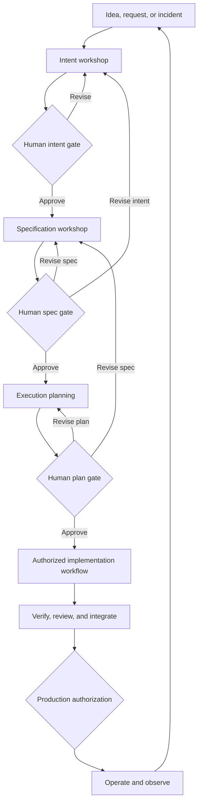

# Diagram — End-to-End AI SDLC Flow

The three playbook stages end at the approved plan. Implementation and production are shown to clarify the closed loop, but require separate authorization and controls.
