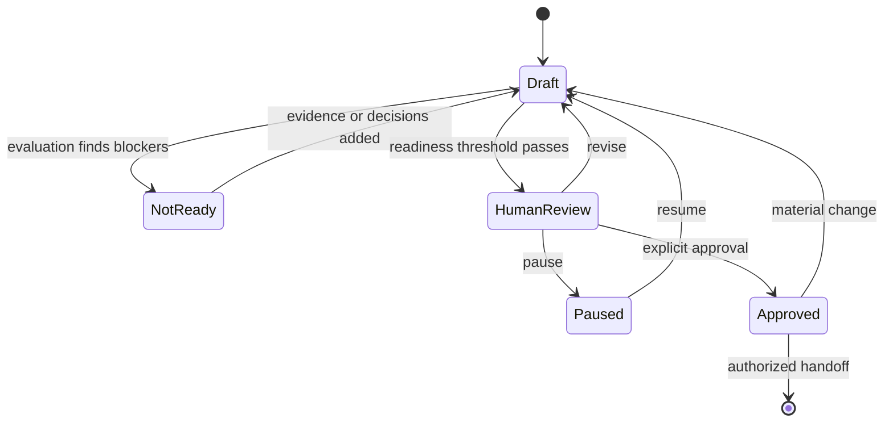

# Diagram — Artifact State Machine

```mermaid
stateDiagram-v2
    [*] --> Draft
    Draft --> NotReady: evaluation finds blockers
    NotReady --> Draft: evidence or decisions added
    Draft --> HumanReview: readiness threshold passes
    HumanReview --> Draft: revise
    HumanReview --> Paused: pause
    Paused --> Draft: resume
    HumanReview --> Approved: explicit approval
    Approved --> Draft: material change
    Approved --> [*]: authorized handoff
```

Approval is tied to the exact artifact and its upstream baselines. A material change returns the artifact to draft and may invalidate downstream approvals.
