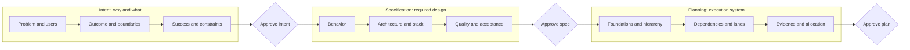

# Diagram — Stage Responsibilities and Gates

```mermaid
flowchart LR
    subgraph INT["Intent: why and what"]
        I1["Problem and users"] --> I2["Outcome and boundaries"]
        I2 --> I3["Success and constraints"]
    end
    subgraph SPEC["Specification: required design"]
        S1["Behavior"] --> S2["Architecture and stack"]
        S2 --> S3["Quality and acceptance"]
    end
    subgraph PLAN["Planning: execution system"]
        P1["Foundations and hierarchy"] --> P2["Dependencies and lanes"]
        P2 --> P3["Evidence and allocation"]
    end
    I3 --> G1{"Approve intent"}
    G1 --> S1
    S3 --> G2{"Approve spec"}
    G2 --> P1
    P3 --> G3{"Approve plan"}
```

Each gate confirms a different contract. Approval never transfers automatically to the next stage.
