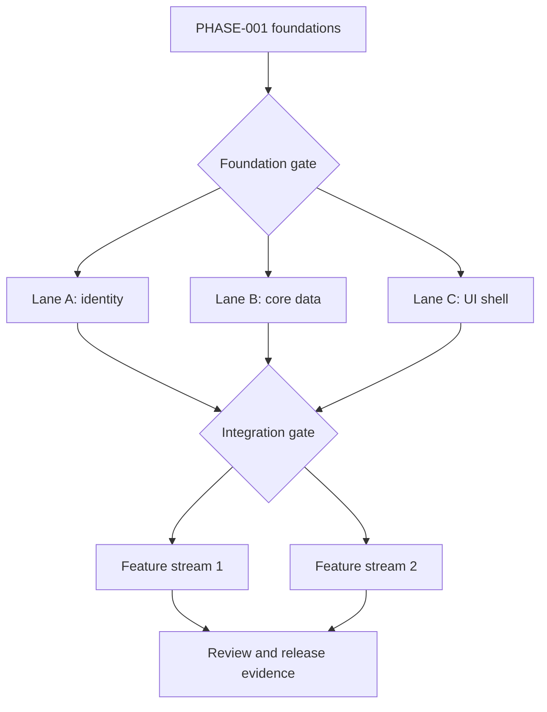

# Diagram — Dependency-Aware Parallel Planning

Parallelism begins only when the dependency gate is satisfied and lanes have non-conflicting ownership. Effective concurrency is limited by supervision, review, integration, and environment capacity—not merely available agents.
