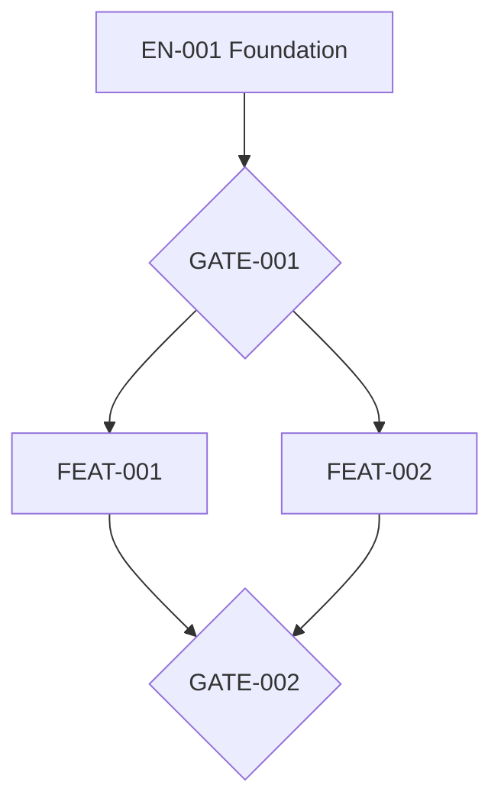

# Execution Plan: [Name]

## Control

| Field | Value |
|---|---|
| Type | Project / Feature / Improvement / Bug |
| Status | Draft / Ready for Human Review / Approved — Ready to Implement |
| Version | `0.1` |
| Specification baseline | `[spec version/link]` |
| Intent baseline | `[intent version/link]` |
| Repository/base revision | `[repo]` @ `[commit]` |
| Planning owner | [Name/role] |
| Last updated | YYYY-MM-DD |

## Executive execution summary

[Foundational sequence, major workstreams, critical path, and principal risks.]

## Verified baseline

| Evidence | Status | Source |
|---|---|---|
| Repository and base revision | Observed / Reported / Unknown | [Reference] |
| Project instructions | [Status] | [Path] |
| Build/lint/test/eval commands | [Status] | [Commands/source] |
| Schemas/contracts/deployment | [Status] | [Paths/sources] |

If repository access is absent, mark the plan `PROVISIONAL — REPOSITORY VERIFICATION REQUIRED`.

## Implementation decisions

| ID | Decision within approved architecture | Evidence | Status | Owner |
|---|---|---|---|---|
| `IMP-001` | [Implementation approach] | Spec/repository basis | Proposed / Approved | [Owner] |

Architecture, tenancy, security, externally visible behavior, or AI-autonomy exceptions must return to specification.

## Phase map

| Phase | Outcome | Entry | Enablers/epics | Exit gate | Depends on |
|---|---|---|---|---|---|
| `PHASE-001` | [Foundation outcome] | [Conditions] | `EN-001` | `GATE-001` | None |

## Enabler and epic map

| ID | Type | Outcome | Unlocks | Owner | Child plan |
|---|---|---|---|---|---|
| `EN-001` | Enabler | [Foundation capability] | [Downstream IDs] | [Owner] | [Link if needed] |
| `EP-001` | Epic | [Functionality] | [Features] | [Owner] | [Link if needed] |

## Feature and work-package map

| ID | Parent | Demonstrable outcome | Tasks | Verification | Dependencies |
|---|---|---|---|---|---|
| `FEAT-001` | `EP-001` | [Outcome] | `TASK-001` | [Evidence] | `EN-001` |

## Dependency graph and critical path

- Critical path: [Ordered IDs and rationale]
- Sequential constraints: [Why work cannot move earlier]
- Cycles detected: [None or resolution]

## Parallel execution groups

| Group | Ready after | Work items | Conflict boundary | Integration order | Owner |
|---|---|---|---|---|---|
| `PG-001` | `GATE-001` | `TASK-001`, `TASK-002` | [Non-overlapping surfaces] | [Order] | [Integrator] |

## Engineer-agent allocation

| Lane | Engineer | Agent/runtime | Worktree/branch | Environment | Delegation | Monitoring | Supervision units | Review owner |
|---|---|---|---|---|---|---|---:|---|
| `LANE-001` | [Name/role] | Local / Cloud / Sandbox | [Proposed] | [Env] | `D0–D5` | [Mode] | [1–5] | [Owner] |

Record team availability, expertise, review windows, environment limits, and reserve capacity. Never invent them.

## Task packets and ready queue

| Task | Outcome | Dependencies | Expected write set | Tests/evals | Autonomy | Queue state |
|---|---|---|---|---|---|---|
| `TASK-001` | [Atomic outcome] | [IDs] | [Paths/surfaces] | [Commands/evidence] | [Level] | Blocked / Ready supervised / Ready async / Overnight safe / Review / Integration |

A task is `READY FOR AGENT` only when it defines:

- exact approved parent requirements;
- verified base and relevant context;
- bounded outcome, write set, and protected surfaces;
- dependencies, interfaces, and expected artifacts;
- tests/evals and pass conditions;
- time/resource bounds, stop conditions, and escalation;
- handoff format, owner, reviewer, and integration destination.

## Gates and evidence

| ID | Permits | Required evidence | Evidence owner | Approver |
|---|---|---|---|---|
| `GATE-001` | [Downstream work] | [Tests/evals/inspection/demo] | [Owner] | [Human] |

## Requirement traceability

| Spec requirement | Work items | Test/eval | Completion evidence | Release evidence |
|---|---|---|---|---|
| `FR-001` | `TASK-001` | [Evidence ID] | [Artifact] | `GATE-002` |

## Integration and review strategy

- Ownership boundaries: [Modules/contracts]
- Shared-contract policy: [Owner and change sequence]
- Merge/integration order: [Order]
- Review batching and WIP limit: [Rule]
- Conflict and stale-base handling: [Rule]
- Execution-report requirement: [Fields and evidence]

## Test, eval, security, and operational plan

- Functional tests: [Work/evidence]
- Contract/integration/end-to-end: [Work/evidence]
- Tenant/security/privacy: [Work/evidence]
- AI evals/HIL/tool safety: [Work/evidence]
- Performance/reliability/observability: [Work/evidence]
- Migration/data verification: [Work/evidence]

## Rollout, rollback, and recovery

- Environments and promotion gates: [Plan]
- Feature flags/cohorts/canary: [Plan]
- Migration order and recovery: [Plan]
- Rollback triggers and owner: [Plan]
- Production authorization boundary: [Human/policy]

## Capacity and throughput

- Dependency-ready work: [Count/constraint]
- Available supervision: [Evidence]
- Non-conflicting lanes: [Count/constraint]
- Review capacity: [Constraint]
- Integration capacity: [Constraint]
- Environment/test capacity: [Constraint]
- Effective lane bottleneck: [Result and rationale]
- Delivery window: [Range, assumptions, uncertainty]

## Risks, assumptions, decisions, and blockers

| ID | Type | Item | Impact | Owner | Mitigation/validation |
|---|---|---|---|---|---|
| `PLN-001` | Risk / Assumption / Decision / Blocker | [Item] | [Impact] | [Owner] | [Action] |

## Readiness and approvals

### Checkpoint 1 — decomposition

- Human agreement on phases, enablers, epics, dependencies, critical path, and gates: [Evidence]

### Checkpoint 2 — orchestration

- Human agreement on parallel groups, allocation, worktrees, supervision, integration, and risk: [Evidence]

### Final gate

- Readiness status: `NOT READY` / `READY FOR HUMAN REVIEW`
- Score: [0–100]
- Blocking gaps: [List or `None`]
- Approved by: [Human only]
- Approved plan/spec/base combination and statement/date: [Evidence]
